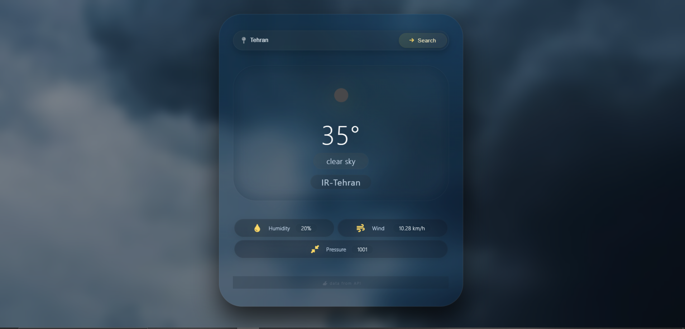

# 🌤️ Skyline — Real-Time Weather App

<div align="center">


**A glassmorphism-styled weather dashboard built with vanilla JavaScript to practice working with the Fetch API.**

[Overview](#-overview) • [Features](#-features) • [Setup](#-setup--api-key) • [Project Structure](#-project-structure) • [Preview](#-preview) • [Disclaimer](#-disclaimer)

</div>

---

## 📖 Overview

**Skyline** is a front-end practice project that fetches live weather data from the [OpenWeatherMap](https://openweathermap.org/) API and displays it through a clean, modern interface.

The UI (HTML + CSS) was pre-built with static placeholder values so the focus stays entirely on the JavaScript side: calling the API with `fetch`, parsing the JSON response, and dynamically updating the DOM with the real data — temperature, wind speed, atmospheric pressure, humidity, and the matching weather icon.

This project was created purely for **learning purposes** — to practice using the `fetch` API to consume a real-world API and to better understand the structure of its responses and asynchronous JavaScript. It is not intended for production use.

---

## ✨ Features

- 🔍 **City search** — enter any city name and fetch its current weather
- 🌡️ **Live weather data** — temperature, feels-like, daily high/low
- 💧 **Key metrics** — humidity, wind speed, pressure, and visibility
- 🖼️ **Dynamic weather icon** — updates automatically based on the current condition
- 🎨 **Modern glass UI** — blurred background, soft glow effects, and smooth micro-interactions
- 📱 **Fully responsive** — works on both desktop and mobile screens

---

## 🛠️ Tech Stack

| Layer | Technology |
|---|---|
| Structure | HTML5 |
| Styling | CSS3 (Glassmorphism, custom animations) |
| Logic | Vanilla JavaScript (`fetch` API) |
| Data Source | [OpenWeatherMap API](https://openweathermap.org/api) |

---

## 🔑 Setup & API Key

This project requires a **free API key** from OpenWeatherMap to fetch live weather data.

### Step 1 — Get your API key
1. Go to [openweathermap.org](https://openweathermap.org/) and create a free account
2. Navigate to the **API keys** tab in your account dashboard
3. Copy your personal API key

### Step 2 — Add it to the project
Open the JavaScript file and locate the `apiKey` variable near the top of the file:

```js
const apiKey = "YOUR_API_KEY_HERE";
```

Replace `"YOUR_API_KEY_HERE"` with the key you copied from your OpenWeatherMap account, then save the file.

> ⚠️ **Note:** A newly generated API key can take a few minutes up to a couple of hours to activate. If your requests fail right after signing up, wait a bit and try again.

### Step 3 — Run the project
Simply open the `index.html` file in your browser — no build tools or installation required.

---

## 📁 Project Structure

```
skyline-weather-app/
│
├── index.html        # Markup + styling (UI)
├── script.js          # JavaScript logic (API calls, DOM updates)
└── README.md          # Project documentation
```

---

## 🖼️ Preview

<div align="center">




</div>

---

## ⚠️ Disclaimer

This project was built **strictly as a learning exercise** to practice:
- Making asynchronous requests with `fetch`
- Understanding and parsing a real API's JSON response structure
- Manipulating the DOM based on dynamic data

It is **not** a production-ready application and should not be used as one.

---

<div align="center">

Made with ☕ while learning JavaScript

</div>